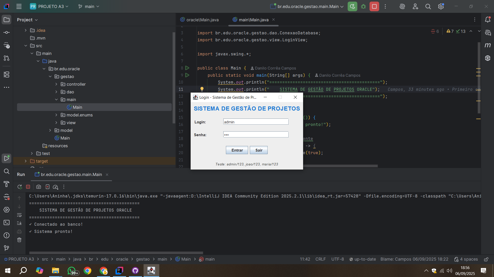
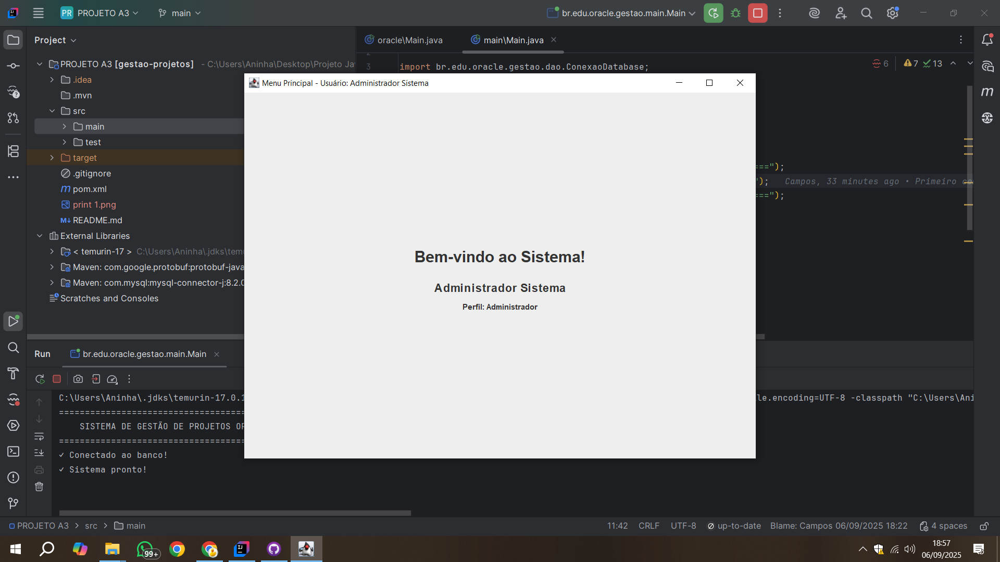

# Sistema de Gestão de Projetos Oracle

## Descrição
Sistema desenvolvido em Java para gestão de projetos, equipes e tarefas, focado em clientes Oracle que trabalham com desenvolvimento orientado a projetos.

## Funcionalidades
- ✅ Sistema de login com diferentes perfis (Administrador, Gerente, Colaborador)
- ✅ Cadastro e gerenciamento de usuários
- ✅ Gestão de projetos com controle de status e prazos
- ✅ Interface gráfica amigável em Java Swing
- ✅ Banco de dados MySQL integrado

## Tecnologias Utilizadas
- **Java 17** - Linguagem principal
- **Java Swing** - Interface gráfica
- **MySQL 8.0** - Banco de dados
- **JDBC** - Conectividade com banco
- **Maven** - Gerenciamento de dependências
- **IntelliJ IDEA** - IDE de desenvolvimento

## Como Executar

### Pré-requisitos
- JDK 17 ou superior
- MySQL 8.0 ou superior
- IntelliJ IDEA (ou IDE compatível)

### Configuração do Banco
1. Instale o MySQL
2. Execute o script SQL localizado em `/docs/database.sql`
3. Configure as credenciais em `ConexaoDatabase.java`

### Execução
1. Clone o repositório
2. Abra o projeto no IntelliJ IDEA
3. Configure a senha do MySQL em `ConexaoDatabase.java`
4. Execute a classe `Main.java`
5. Use as credenciais de teste:
    - **admin/123** (Administrador)
    - **joao/123** (Gerente)
    - **maria/123** (Colaborador)

### Descrição dos Componentes

**Main:** Classe principal que inicia a aplicação  
**Model:** Entidades e regras de negócio  
**DAO:** Acesso e operações com banco de dados  
**View:** Interfaces gráficas do sistema  
**Controller:** Lógica de controle e validação

## Screenshots

### Tela de Login

### Menu Principal
